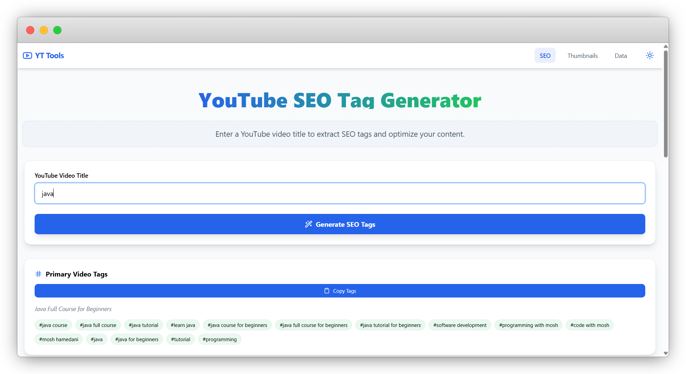

📺 YouTube SEO Tools (SaaS) :-

  

YouTube SEO Tools is a full-stack SaaS utility designed to help content creators boost their video reach. The application leverages the YouTube Data API v3 to extract hidden metadata and generate SEO-optimized tags to improve search rankings.

🚀 Live Demo :-

Frontend: https://saas-product-1.onrender.com

Backend API: https://saas-product-63r6.onrender.com

✨ Key Features :-

i.   Tag Extractor: Extract "hidden" tags and keywords from any YouTube video simply by pasting the URL.

ii.  SEO Keyword Generator: Generate high-ranking SEO tags based on video titles using intelligent metadata analysis.

iii. Thumbnail Fetcher: Preview and download high-resolution thumbnails with a single click.

iv.  Responsive UX: Fully optimized for a seamless experience across Desktop, Tablets, and Mobile devices.

v.   Dockerized Backend: Completely containerized backend for scalable and consistent deployment.

🛠️ Tech Stack :-

Frontend: React.js, Tailwind CSS, Axios.

Backend: Java 21, Spring Boot 3, Maven.

API Integration: YouTube Data API v3.

DevOps: Docker (Multi-stage builds), Render (Cloud Hosting).

Security: Custom CORS Configuration to handle secure Cross-Origin requests.

🐳 Docker Configuration :-

I implemented a Multi-stage Docker Build to separate the build-time environment from the runtime environment. This significantly reduces the final image size and ensures faster deployments.

Commands to run locally:

# Build the Docker image
docker build -t youtube-seo-tool .

# Run the container locally
docker run -p 8080:8080 youtube-seo-tool

⚙️ Installation & Local Setup :- 

1. Clone the Repository
Bash

git clone https://github.com/pra9536/SAAS-Product.git 

2. Backend Setup
Navigate to the backend directory.

Set your YOUTUBE_API_KEY and ALLOWED_ORIGIN in src/main/resources/application.properties.

Run Maven build:

Bash

mvn clean install
Start the Spring Boot application.

3. Frontend Setup
Navigate to Frontend/youtube-tools-frontend.

Install dependencies:

Bash

npm install
Start the development server:

Bash

npm start 

📝 Learning Outcomes :- 

i.   API Integration: Mastered handling complex JSON responses and quota management with YouTube Data API.

ii.  DevOps Excellence: Gained hands-on experience in writing efficient Dockerfiles and optimizing images using multi-stage builds.

iii. Full-stack Architecture: Successfully architected a decoupled system, solving real-world security challenges like CORS in a multi-cloud hosting environment.
